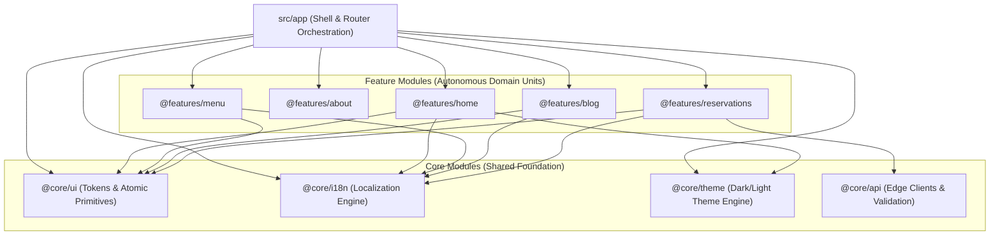

# Modern Web Engineering & Architecture Guidelines

This file is the master specification and operational rulebook for building and maintaining architecturally sound, high-performance, and visually stunning web applications. It synthesizes the production-proven patterns from the **Panorama** (commercial/hospitality platform) and **Quantum-CV** (academic/content platform) codebases, incorporating the latest modern web development standards and a **Gradle-inspired Lightweight Modular Architecture**.

---

## 1. Core Tech Stack & Engineering Standards

- **Runtime & Framework**: **React 19** + **TypeScript** (Strict mode). All source files must be `.tsx` / `.ts`.
- **Bundler & Dev Server**: **Vite** with `@vitejs/plugin-react` (or `@vitejs/plugin-react-swc`).
- **Styling**: **Vanilla CSS** with a centralized CSS custom property (design token) system in `@core/ui/tokens.css` (or `src/styles/index.css`).
  - **Rule**: Do NOT introduce TailwindCSS or CSS-in-JS libraries (e.g. styled-components, Emotion) unless explicitly requested. Zero runtime styling overhead is mandatory.
- **Linting**: **Oxlint** (`oxlint`), configured via `.oxlintrc.json` for ultra-fast, modern linting.
- **Testing**: Colocated test files (`*.test.tsx` / `*.test.ts`) tested with **Vitest** + React Testing Library.
- **Hosting & Serverless Edge**: **Cloudflare Pages** + **Pages Functions** (`functions/api/*.ts`).
- **Standard Run Commands**:
  - `npm run dev`: Start local Vite frontend dev server.
  - `npm run build`: Production build (`tsc -b && vite build`).
  - `npm run lint`: Fast linting with `oxlint`.
  - `npm run pages:dev`: Emulate full edge stack locally (`wrangler pages dev dist`).
  - `npm run typecheck`: Strict TypeScript typechecking across client and server.

---

## 2. Lightweight Modular Architecture (Gradle-Inspired)

The codebase is organized into autonomous, decoupled modules with strict public API boundaries, mirroring a Gradle multi-module architecture without the overhead of multi-package tooling.

### 2.1 Module Hierarchy & Dependency Graph



### 2.2 Architectural Rules of Autonomy
1. **Unidirectional Dependency Flow**:
   - `App` depends on `Features` and `Core`.
   - `Features` depend ONLY on `Core`.
   - `Core` has ZERO dependencies on `Features` or `App`.
   - **Feature-to-Feature Isolation**: A feature module MUST NOT import private internals of another feature. If a feature needs shared data, that data is either promoted to `@core` or accessed strictly via the other feature's public `index.ts`.
2. **Public API Encapsulation (Barrel Boundary)**:
   - Every feature and core module MUST have a root `index.ts`.
   - External consumers MUST import via the module's path alias (e.g. `import { HomePage } from '@features/home'`), NEVER reaching into internal file paths (e.g. `import { Hero } from '@features/home/components/Hero'`).
3. **Colocated Internals**:
   - Everything a module owns stays inside its folder: components, styles, data models, utility functions, and unit tests (`*.test.tsx`).

---

## 3. Directory Layout & Path Aliases

### 3.1 Folder Structure
```
src/
├── app/                     # Application Shell & Orchestration
│   ├── App.tsx              # Root Layout, Router & Provider Wiring
│   ├── App.css
│   ├── routes.ts            # Route table & navigation mappings
│   └── testUtils.tsx        # Test wrapper utilities (Providers + Router)
│
├── core/                    # Autonomous Foundation Modules
│   ├── ui/                  # Design tokens, global resets & atomic UI primitives
│   │   ├── tokens.css       # Semantic design tokens (:root, [data-theme])
│   │   ├── Button.tsx       # Reusable Button + Button.css + Button.test.tsx
│   │   ├── Card.tsx         # Reusable Card + Card.css + Card.test.tsx
│   │   ├── Modal.tsx        # Focus-trapped accessible dialog
│   │   └── index.ts         # Public API contract for @core/ui
│   ├── theme/               # Dark/Light theme provider & hook
│   │   ├── ThemeContext.tsx
│   │   └── index.ts         # Public API contract for @core/theme
│   ├── i18n/                # Zero-dependency type-safe localization
│   │   ├── LanguageContext.tsx
│   │   ├── siteCopy.ts      # Compile-time verified copy trees
│   │   └── index.ts         # Public API contract for @core/i18n
│   └── api/                 # Shared edge clients, DNS/email validation
│       ├── dohValidation.ts
│       ├── typoDetection.ts
│       └── index.ts         # Public API contract for @core/api
│
├── features/                # Autonomous Feature Modules
│   ├── home/                # Home feature module
│   │   ├── components/      # Private, feature-internal components
│   │   ├── Home.tsx         # Main feature view
│   │   ├── Home.css
│   │   ├── Home.test.tsx
│   │   └── index.ts         # Public API contract for @features/home
│   ├── menu/                # Menu feature module (data + UI)
│   │   ├── menuData.ts      # Menu items + localized getters
│   │   ├── Menu.tsx
│   │   ├── Menu.css
│   │   └── index.ts
│   └── blog/                # Blog feature module
│       ├── blogParser.ts
│       ├── Blog.tsx
│       └── index.ts
│
├── main.tsx                 # Application Entry Point
│
functions/api/               # Cloudflare Pages Functions (Serverless Edge API routes)
server/                      # Shared server-side logic (email templates, validation)
public/                      # Static assets (_redirects, _headers, robots.txt, llms.txt, favicon)
```

### 3.2 Path Aliases Configuration

**`tsconfig.app.json`**:
```json
{
  "compilerOptions": {
    "baseUrl": ".",
    "paths": {
      "@app/*": ["src/app/*"],
      "@core/*": ["src/core/*"],
      "@features/*": ["src/features/*"]
    }
  }
}
```

**`vite.config.ts`**:
```typescript
import { defineConfig } from 'vite';
import react from '@vitejs/plugin-react';
import path from 'node:path';

export default defineConfig({
  plugins: [react()],
  resolve: {
    alias: {
      '@app': path.resolve(__dirname, './src/app'),
      '@core': path.resolve(__dirname, './src/core'),
      '@features': path.resolve(__dirname, './src/features'),
    },
  },
});
```

---

## 4. Design Token System & CSS Architecture

All visual styling is governed by semantic CSS tokens defined in `@core/ui/tokens.css` (or `src/styles/index.css`).

### 4.1 Token Hierarchy & Organization
```css
/* Shared design tokens (radii, transitions, fonts, spacing) */
:root {
  --font-heading: 'Playfair Display', Georgia, serif;
  --font-body: 'Inter', system-ui, -apple-system, sans-serif;
  --font-mono: 'JetBrains Mono', 'Fira Code', monospace;

  --radius-sm: 4px;
  --radius-md: 8px;
  --radius-lg: 16px;
  --radius-full: 9999px;

  --transition-fast: 0.15s ease;
  --transition-base: 0.25s ease;
  --transition-slow: 0.4s cubic-bezier(0.16, 1, 0.3, 1);
}

/* Light theme tokens */
:root,
[data-theme="light"] {
  color-scheme: light;
  --bg-primary: #FAFAFA;
  --bg-surface: #FFFFFF;
  --bg-card: #FFFFFF;
  --bg-navbar: rgba(255, 255, 255, 0.92);
  
  --text-main: #1A202C;
  --text-muted: #4A5568;
  --text-subtle: #718096;
  
  --color-primary: #004F7A;
  --color-primary-hover: #003B5C;
  --color-secondary: #F28C28;
  --color-secondary-hover: #D97718;

  --border-color: #E2E8F0;
  --border-subtle: #EDF2F7;
  --shadow-sm: 0 1px 3px rgba(0, 0, 0, 0.05);
  --shadow-md: 0 4px 12px rgba(0, 0, 0, 0.08);
  --shadow-lg: 0 12px 32px rgba(0, 0, 0, 0.12);
}

/* Dark theme tokens */
[data-theme="dark"] {
  color-scheme: dark;
  --bg-primary: #0D1117;
  --bg-surface: #161B22;
  --bg-card: #1C2128;
  --bg-navbar: rgba(13, 17, 23, 0.92);

  --text-main: #E6EDF3;
  --text-muted: #C9D1D9;
  --text-subtle: #8B949E;

  --color-primary: #58A6FF;
  --color-primary-hover: #79B8FF;
  --color-secondary: #F28C28;
  --color-secondary-hover: #FFA657;

  --border-color: #30363D;
  --border-subtle: #21262D;
  --shadow-sm: 0 1px 3px rgba(0, 0, 0, 0.3);
  --shadow-md: 0 4px 12px rgba(0, 0, 0, 0.4);
  --shadow-lg: 0 12px 32px rgba(0, 0, 0, 0.6);
}
```

### 4.2 Modern CSS Rules
1. **Never hardcode hex/rgb colors** inside feature or component `.css` files; always reference `var(--token-name)`.
2. **Text Wrapping & Typography**: Use `text-wrap: balance;` on headings and `text-wrap: pretty;` on body copy to prevent typographic orphans.
3. **Micro-Interactions**: Use CSS variables for interactive state transforms (e.g. `transform: translateY(-2px);` on cards with `var(--transition-base)`).
4. **Glassmorphism**: Restrict backdrop filters (`backdrop-filter: blur(12px)`) to sticky navigational elements to prevent GPU compositing thrash.
5. **Mobile-First Responsive Layouts**:
   - Base styles: Mobile (<768px).
   - Tablets & Small Screens: `@media (min-width: 768px)`.
   - Desktop & Large Screens: `@media (min-width: 1024px)`.
   - Max-width content constraint: `.container { max-width: 1200px; margin: 0 auto; padding: 0 1.5rem; }`.

---

## 5. Typography & Asset Performance (Core Web Vitals)

### 5.1 Self-Hosted Local Fonts (Zero Third-Party CDN Calls)
Never load fonts via Google Fonts CDN `<link>` or `@import url('https://fonts.googleapis.com/...')` in production.
- **Approach A (Bundled Packages via Fontsource)**:
  Install `@fontsource/<family>` and import directly into `@core/ui/tokens.css`:
  ```css
  @import '@fontsource/inter/400.css';
  @import '@fontsource/inter/600.css';
  @import '@fontsource/playfair-display/600.css';
  ```
- **Approach B (Preloaded Static WOFF2 Assets)**:
  Store compressed `.woff2` files in `/public/fonts/` and preload in `index.html`:
  ```html
  <link rel="preload" href="/fonts/inter-400.woff2" as="font" type="font/woff2" crossorigin />
  ```

### 5.2 Largest Contentful Paint (LCP) Optimization
1. **Hero Media Preloading**: Preload candidate LCP images in `index.html` with `fetchpriority="high"` and responsive `imagesrcset`:
   ```html
   <link
     rel="preload"
     fetchpriority="high"
     as="image"
     href="/images/hero.webp"
     type="image/webp"
     imagesrcset="/images/hero-mobile.webp 768w, /images/hero.webp 1920w"
     imagesizes="100vw"
   />
   ```
2. **Image Formats**: All images must be modern **WebP** or **AVIF** with explicit `width`, `height`, and `loading="lazy"` (except hero images, which must be `loading="eager"` with `fetchpriority="high"`).
3. **Cumulative Layout Shift (CLS)**: Every container with media or asynchronous content must define an `aspect-ratio` or fixed skeleton dimensions.

---

## 6. Zero-Dependency Type-Safe Localization (i18n)

External i18n libraries add runtime parsing overhead and loose string keys. Instead, implement a zero-dependency compile-time type-safe context in `@core/i18n`.

### 6.1 Compile-Time Key Parity via Subtyping
In `@core/i18n/siteCopy.ts`:
```typescript
export type Language = 'en' | 'el' | 'it';

export const copyEN = {
  nav: { home: 'Home', about: 'About', contact: 'Contact' },
  hero: { title: 'Welcome', subtitle: 'Experience the finest quality' },
};

// Guarantee 100% compile-time parity between all language trees
export const copyEL: typeof copyEN = {
  nav: { home: 'Αρχική', about: 'Σχετικά', contact: 'Επικοινωνία' },
  hero: { title: 'Καλώς Ήρθατε', subtitle: 'Ζήστε την απόλυτη εμπειρία' },
};

export const SITE_COPY: Record<Language, typeof copyEN> = {
  en: copyEN,
  el: copyEL,
  it: copyEN,
};

export function getCopy(lang: Language): typeof copyEN {
  return SITE_COPY[lang] || copyEN;
}
```

### 6.2 Zero-Allocation Static Dataset Getters
For static feature data (e.g. menu items, portfolio items, services), pre-compute localized arrays at module evaluation time so re-renders incur zero memory allocations:
```typescript
const MENU_EN: MenuItem[] = [...];
const MENU_EL: MenuItem[] = [...];

export function getMenuItems(lang: Language): MenuItem[] {
  return lang === 'el' ? MENU_EL : MENU_EN;
}
```

---

## 7. Serverless Edge API & Backend Security

When building API routes with **Cloudflare Pages Functions** (`functions/api/*.ts`):

### 7.1 Defense-in-Depth & Anti-Bot Protection
1. **Honeypot Trap**: Include a hidden form field (e.g. `website`). If filled by an automated scraper, return a fake `200 OK` success response without executing downstream actions.
2. **Submission Timing Gates**: Pass `formRenderedAt: number` timestamp. Submissions completing in `<1500ms` are rejected as bots.
3. **Payload Sanitization & Constraints**: Enforce strict length limits on all text fields (`fullName` max 100, `message` max 1000) and strict email regex: `/^[^\s@,;]+@[^\s@,;]+\.[^\s@,;]+$/`.
4. **DoH MX Record Verification**: Before sending transactional emails, verify the recipient's domain has valid MX records using Cloudflare DNS over HTTPS (`https://cloudflare-dns.com/dns-query?name=${domain}&type=MX`).
5. **Typo Suggestions**: Detect common domain typos (e.g. `gmai.com`, `hotmial.com`) and return helpful suggestions.
6. **Edge Timezones**: Cloudflare Workers run on UTC. When verifying local dates, always pass the explicit target IANA timezone:
   ```typescript
   new Intl.DateTimeFormat('sv-SE', { timeZone: 'Europe/Athens' }).format(new Date());
   ```

### 7.2 Transactional Email vs Domain Email Routing
- **Inbound Domain Email**: Use Cloudflare **Email Routing** (free MX/TXT records) to forward domain addresses to real inboxes.
- **Outbound Transactional Email**: Use a dedicated delivery provider (e.g. **Resend**) with verified DKIM/SPF DNS records and an API key stored as a Cloudflare Secret (`RESEND_API_KEY`).

---

## 8. SEO, LLM Readiness & Accessibility (a11y)

### 8.1 Search & LLM Discovery Assets
- **JSON-LD Schema**: Include structured data graphs in `index.html` matching the entity (`WebSite`, `Restaurant`, `Person`, `Organization`, `PostalAddress`, `FoodEstablishmentReservation`).
- **`public/llms.txt`**: Provide a clean Markdown manifest summarizing site structure, contact details, API capabilities, and direct links for AI crawlers and LLMs.
- **OpenGraph & Twitter Meta**: Provide complete social sharing meta tags with absolute image URLs.
- **`public/_redirects`**: Include SPA rewrite rule `/* /index.html 200` to prevent 404s on deep links.
- **`public/_headers`**: Add security headers (`X-Frame-Options: DENY`, `X-Content-Type-Options: nosniff`, `Referrer-Policy: strict-origin-when-cross-origin`) and caching policies.

### 8.2 Accessibility Standards (WCAG 2.2 AA)
1. **Semantic Hierarchy**: Exactly one `<h1>` per page view. Use `<main>`, `<nav>`, `<header>`, `<footer>`, `<section>`, `<article>`.
2. **Keyboard Navigation & Focus Traps**:
   - Modal dialogs and mobile navigation drawers must trap focus, lock body scroll, close on `Escape`, and return focus to the trigger element when closed.
3. **Interactive Targets**: All interactive elements (buttons, links, toggles) must meet a minimum `44px × 44px` touch target size on mobile.
4. **Accessible Links**: Use real `<a href="...">` or React Router `<Link to="...">` for in-app navigation instead of `<button onClick={navigate}>` so users retain middle-click, right-click, and status bar preview capabilities.

---

## 9. Development & Release Verification Checklist

Before considering any change complete:
1. `npm run build` succeeds cleanly with zero TypeScript errors.
2. `npm run lint` (`oxlint`) passes with zero errors and zero warnings.
3. `npm run typecheck` validates both frontend and edge serverless code.
4. If modifying edge API routes, test locally with `npm run pages:dev` (`wrangler pages dev dist`).
5. All interactive UI controls function seamlessly via keyboard (`Tab`, `Enter`, `Escape`) and touch.

---

## 10. View / Logic Separation (Mandatory)

Every feature module MUST maintain a strict split between **data transformation** and **presentation**.

### 10.1 Rules

1. **`.tsx` files are presentation-only.** A React component file (`.tsx`) MUST NOT contain:
   - Raw markdown parsing or string splitting logic
   - Regex-based field extraction
   - Filter/sort algorithms operating on data arrays
   - Fallback value resolution logic

2. **Parser/logic files are framework-free.** Each feature that reads content (markdown, JSON, API) MUST have a colocated `parse<Feature>.ts` file (e.g. `parseCareer.ts`, `parseProjects.ts`). These files:
   - Are plain TypeScript (`.ts`) with zero React imports
   - Export typed data structures and pure transformation functions
   - Import from `@core/config/siteConfig` for constants and fallbacks
   - Import from `@core/utils` for shared parsing primitives

3. **Module-level parsing.** For static content (markdown loaded with `?raw`), call the parser at module scope (outside the component function) so it runs once per bundle, not on every render:
   ```typescript
   // ✅ Correct — parsed once at module load
   const { meta, items } = parseCareer(careerMarkdown);

   export const Experience: React.FC = () => { ... };
   ```

4. **State and event handlers stay in `.tsx`.** UI state (`useState`, `useReducer`), event callbacks, and derived display values (e.g. filtered lists from UI state) belong in the component. They should call the parser output, not duplicate the parsing logic.

### 10.2 File Naming Convention

| Purpose | File | Example |
|---|---|---|
| Data parsing / transformation | `parse<Feature>.ts` | `parseCareer.ts` |
| React view component | `<Feature>.tsx` | `Experience.tsx` |
| Feature-scoped styles | `<Feature>.css` | `Experience.css` |
| Feature public API | `index.ts` | `index.ts` |

### 10.3 Example Pattern

```
src/features/experience/
├── parseCareer.ts      ← pure TS: parsing, types, fallbacks
├── Experience.tsx      ← pure React: layout, state, JSX
├── Experience.css
└── index.ts
```

---

## 11. Centralised Site Configuration (`siteConfig.ts`)

All site-wide constants MUST live in `src/core/config/siteConfig.ts`, imported via `@core/config/siteConfig`.

### 11.1 What belongs in siteConfig

| Category | Examples |
|---|---|
| Owner identity | `OWNER.name`, `OWNER.email`, `OWNER.location` |
| Social & external URLs | `SOCIAL.github`, `SOCIAL.linkedin`, `RESUME_URL` |
| Feature fallback content | `HERO_FALLBACKS`, `EXPERIENCE_FALLBACKS` |
| Filter tag lists | `PROJECT_TAG_FILTERS`, `BLOG_TAG_FILTERS` |
| Keyword/pattern lists | `EXPERIENCE_HIGHLIGHT_KEYWORDS`, `EXPERIENCE_METRIC_PATTERNS` |
| Fallback images | `PROJECT_DEFAULT_IMAGES`, `HOME_DEVICE_IMAGE` |

### 11.2 Rules

1. **No hardcoded strings in component or parser files.** If a string or array of strings controls behaviour (tags, keywords, URLs, fallbacks), it MUST be a named constant in `siteConfig.ts`.
2. **No magic numbers.** Thresholds, limits, or indices must be named constants.
3. **`as const` for readonly arrays.** Use `as const` (or `readonly string[]`) on all exported arrays to prevent accidental mutation.

