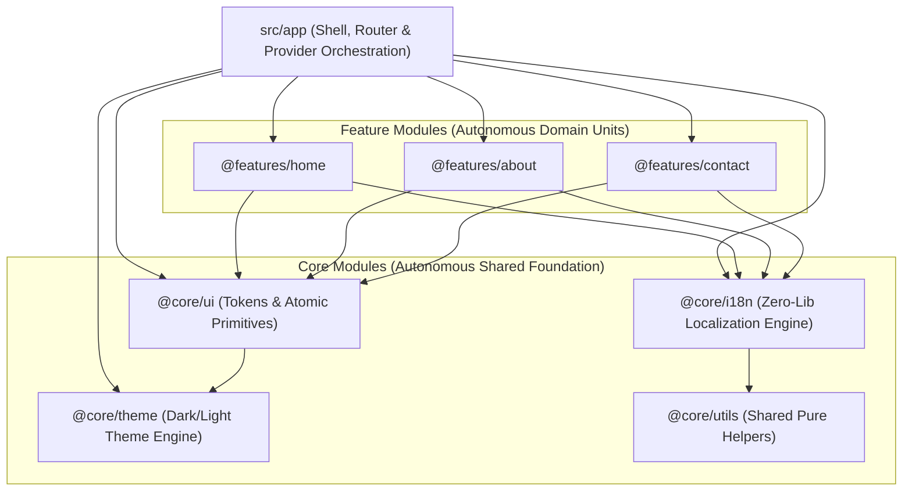

# Lightweight Modular Architecture Guide

This document explains the Gradle-inspired Lightweight Modular Architecture implemented in this template repository.

---

## 1. Architectural Philosophy

Modern frontend codebases often suffer from either:
1. **Unconstrained Sprawl**: Components, hooks, utilities, and constants are dumped into flat directories with arbitrary cyclic imports.
2. **Monorepo Overkill**: Splitting every micro-package into separate `package.json` workspaces with heavy tooling, slow builds, and versioning overhead.

This template adopts the **Lightweight Modular Monolith** pattern:
- Single root `package.json` with ultra-fast Vite builds and zero package manager overhead.
- Strict TypeScript path aliases (`@app/*`, `@core/*`, `@features/*`).
- Public barrel exports (`index.ts`) for strict API encapsulation.
- Unidirectional dependency flow (`App` -> `Features` -> `Core`).

---

## 2. Dependency Hierarchy

---

## 3. Layer Responsibilities

### 3.1 `@core/` (Autonomous Foundation)
- **`@core/ui`**: CSS custom property tokens (`tokens.css`), atomic primitives (`Button`, `Card`, `LinkButton`, `Navbar`, `Footer`, `ThemeToggle`, `LanguageToggle`).
- **`@core/theme`**: React Context & hook managing system preference, explicit user toggle, and `data-theme` attribute synchronization.
- **`@core/i18n`**: Zero-dependency type-safe localization engine enforcing 100% key parity at compile-time.
- **`@core/utils`**: Pure functions, navigation structures, input validation.

### 3.2 `@features/` (Autonomous Feature Modules)
- Each feature encapsulates its own views, components, styles, data getters, and colocated tests (`*.test.tsx`).
- Sibling feature internals are private; communication happens strictly through public `index.ts` exports.

### 3.3 `@app/` (Application Shell & Orchestration)
- Root layout shell (`App.tsx`), global styles (`App.css`), route table (`routes.ts`), and test utilities (`testUtils.tsx`).

---

## 4. Operational Best Practices

1. **Vanilla CSS Design Tokens**: No Tailwind or CSS-in-JS runtime overhead. Use `var(--bg-primary)`, `var(--text-main)`, etc.
2. **Fast Linting**: Oxlint (`npm run lint`) for sub-second linting.
3. **Strict Type Safety**: `npm run typecheck` validates client and edge code.
4. **Cloudflare Edge Serverless**: `functions/api/*.ts` for low-latency backend logic.
